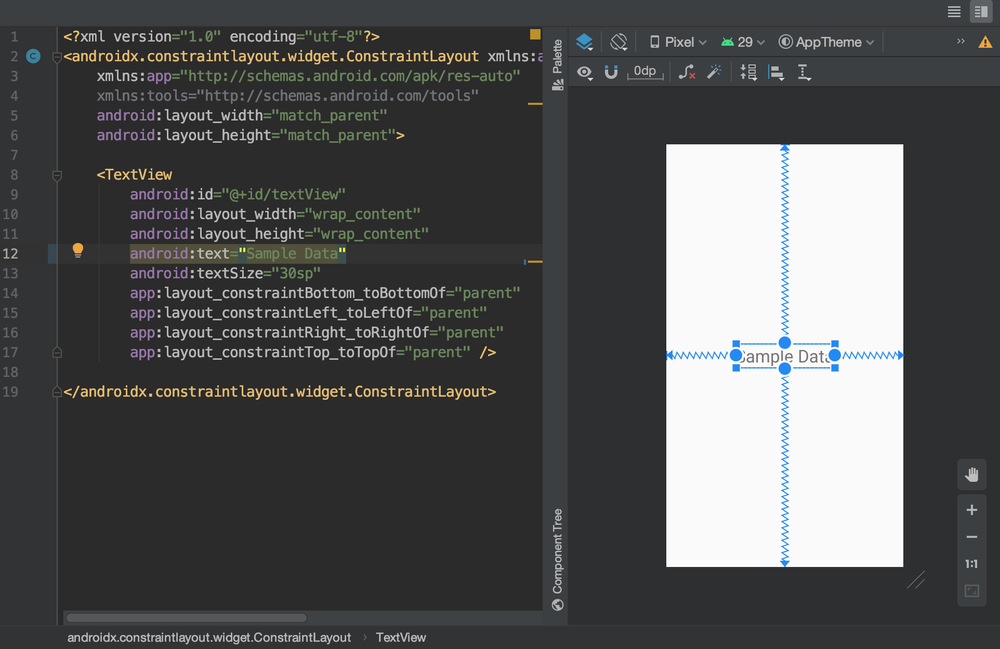
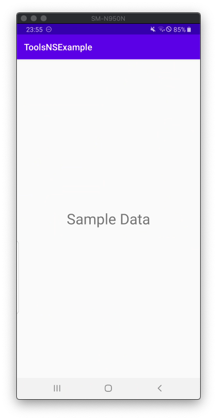
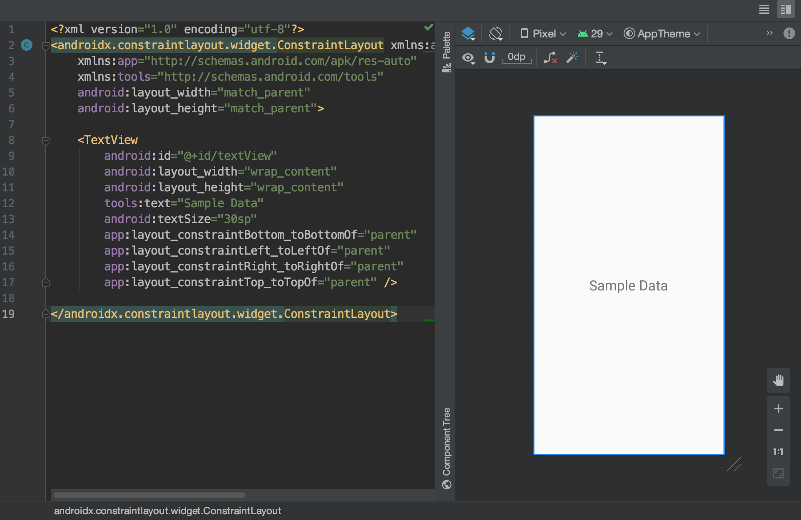
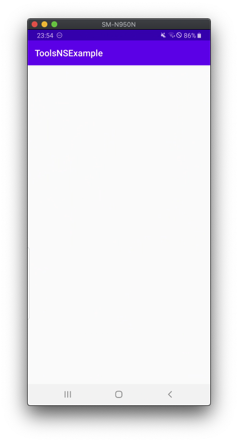

# ToolsNSExample
How to use Dummy Data to preview layout in Android

use tools:text to avoid exposing dummy data to users.

### wrong case code preview

### wrong case app preview

### correct case code preview

### correct case app preview

